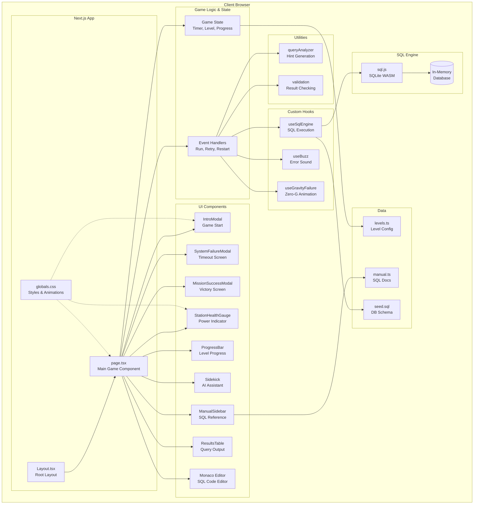
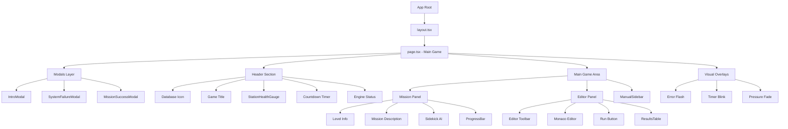
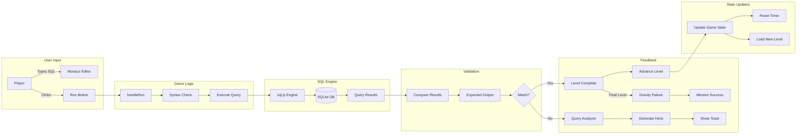
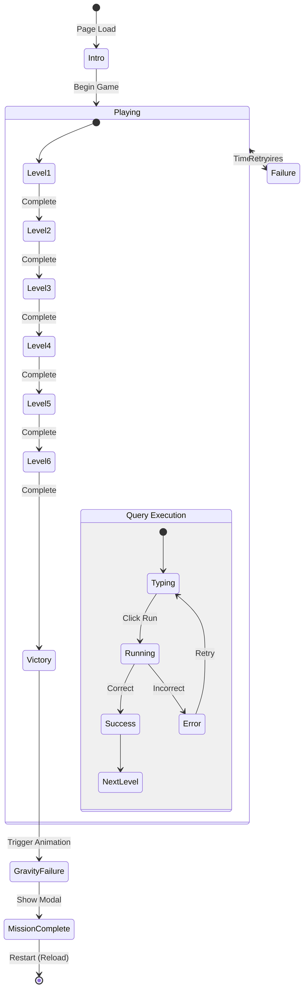
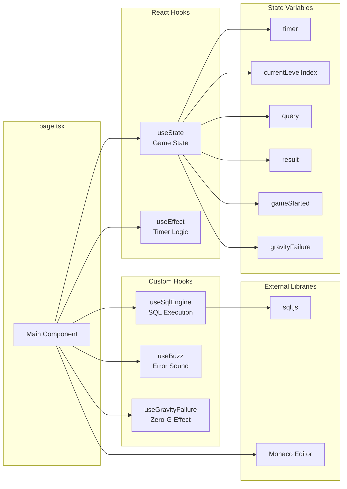
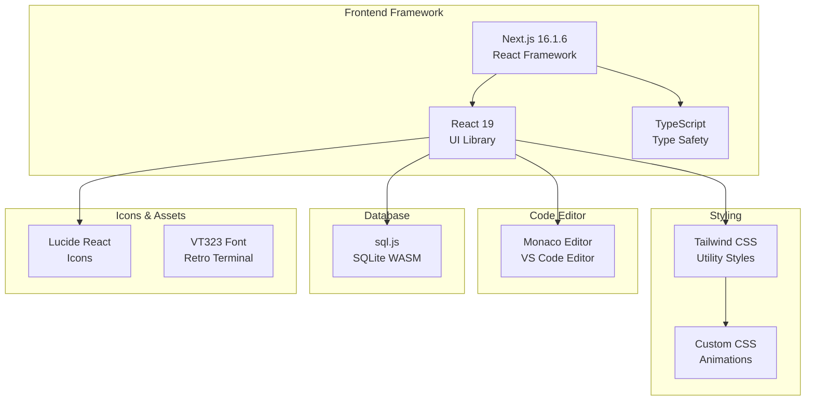
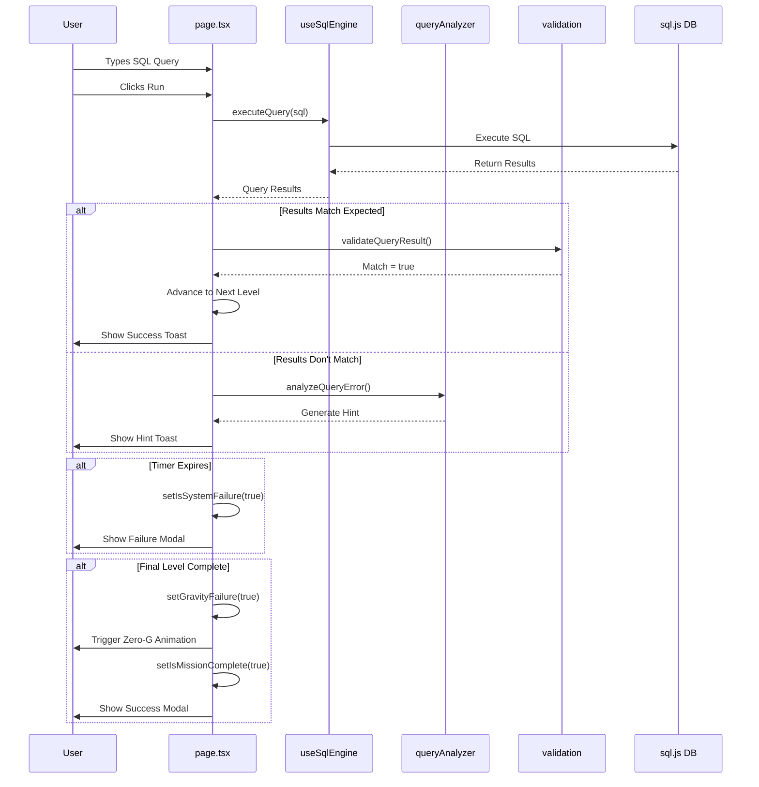

# Query Quest: Protocol Antigravity - Architecture Diagram

## System Architecture Overview



## Component Hierarchy



## Data Flow Architecture



## State Management



## Hook Dependencies



## File Structure

```
sql-trainer/
├── src/
│   ├── app/
│   │   ├── layout.tsx          # Root layout with fonts
│   │   ├── page.tsx            # Main game component (560 lines)
│   │   ├── globals.css         # Styles & animations
│   │   └── favicon.ico
│   │
│   ├── components/
│   │   ├── IntroModal.tsx      # Game start modal
│   │   ├── SystemFailureModal.tsx  # Timeout modal
│   │   ├── MissionSuccessModal.tsx # Victory modal
│   │   ├── StationHealthGauge.tsx  # Power gauge
│   │   ├── ProgressBar.tsx     # Level indicator
│   │   ├── Sidekick.tsx        # AI assistant
│   │   ├── ManualSidebar.tsx   # SQL reference
│   │   └── ResultsTable.tsx    # Query results
│   │
│   ├── hooks/
│   │   ├── useSqlEngine.ts     # SQL execution logic
│   │   ├── useBuzz.ts          # Error sound effect
│   │   └── useGravityFailure.ts # Zero-G animation
│   │
│   ├── utils/
│   │   ├── queryAnalyzer.ts    # Hint generation
│   │   └── validation.ts       # Result validation
│   │
│   └── data/
│       ├── levels.ts           # 6 level configs
│       ├── manual.ts           # SQL documentation
│       └── seed.sql            # Database schema
│
├── public/
│   └── buzz.mp3                # Error sound
│
├── package.json
├── tsconfig.json
├── next.config.ts
└── LICENSE
```

## Technology Stack



## Key Features Flow



---

**Legend:**
- **Solid Lines**: Direct dependencies/imports
- **Dashed Lines**: Styling/theming relationships
- **Arrows**: Data flow direction
- **Subgraphs**: Logical groupings
